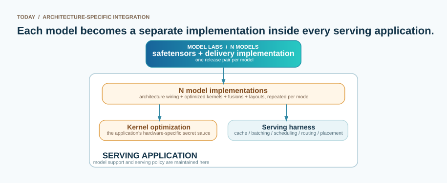
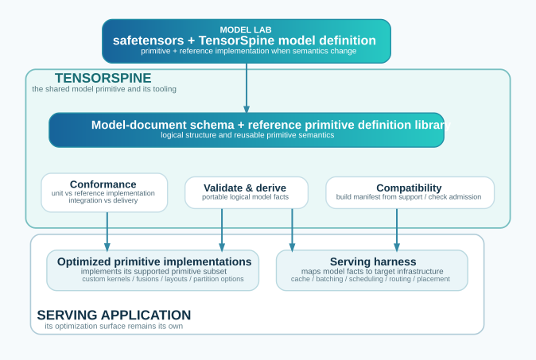

# TensorSpine

**Project documentation:** access it directly at
[maneex.github.io/tensorspine](https://maneex.github.io/tensorspine/).

*An exploratory project: see the [disclaimer](#disclaimer). What validates, derives and runs today
is on the [status page](https://maneex.github.io/tensorspine/status/).*

## How a model reaches serving applications

**Today: each model becomes a separate implementation inside every serving application**

<!-- Title above. -->

<a id="with-tensorspine"></a>
TensorSpine provides the model-document schema, a reference primitive definition library, and the tooling that
validates documents, derives portable logical model facts, and checks compatibility.

**With TensorSpine: model structure becomes shared data; serving optimizations stay application-owned**

<!-- Title above. -->

*One model integration; reusable implementations per primitive branch.*

**Who does what, with what tooling**

| Who | Does what | With what tooling |
|---|---|---|
| A model lab | ships safetensors, a TensorSpine model definition, and any new primitive with its reference implementation | a graphical topology editor; `tensorspine --validate --checkpoint` against its own files; `--derive`; the reference generator's `run` and `compare` against its delivery implementation |
| Anyone, once for all serving applications | transcribes a document for a model the lab did not ship, and locates its weights | the same, plus the dumped fixtures and the whole-model comparison at every valid graph split |
| The language maintainers | maintain the model-document schema, reference primitive library and specification; integrate contributed primitives and reference implementations | `--lint`, `--document primitive library`, the rejection and signature suites; the manifest and conformance tooling |
| A serving application | implements its supported subset of TensorSpine primitives with optimized kernels, fusions, layouts and partition options; owns a harness over the derived model facts | a capabilities manifest built by TensorSpine tooling from its primitive support; `--capabilities MANIFEST MODEL` (can it run this?); `--coverage` (what that application still lacks); the shared fixtures |
| An operator | chooses extracts, placement and physical parameters for one deployment, in its own tooling | the derived state, graph split and payload facts and the serving applications' manifests, read in any language; `--max-ram` as the one-machine instance |

<a id="0-tensorspine-in-four-statements"></a>

## 0. TensorSpine in four statements

1. **Every serving application reimplements every model.** The weights are already data; the
   logical structure and persistent-state semantics should be data too.
2. **Serving is optimisation.** A serving application connects a model, infrastructure and customer
   requests; its competitive value lies in making that connection efficient.
3. **The engine has two halves.** A harness makes serving decisions, while primitive implementations
   execute the model on the available hardware.
4. **TensorSpine supplies their shared model primitive.** Its model-document schema, reference
   primitive definition library and tooling record logical structure as data and derive the facts a harness
   needs without model-specific glue.

<a id="1-why-tensorspine"></a>

## 1. Why TensorSpine

A serving application connects a model's computation and state, the infrastructure's compute,
memory, storage and topology, and customer requests with latency, throughput and cost objectives.
Its competitive value lies in optimising that connection through two halves:

- **The harness** admits, batches, schedules and routes requests; fragments, places and dispatches
  the model; chooses whether to co-locate prefill and decode or disaggregate them; and manages KV
  caches and other persistent state across heterogeneous compute, memory, storage and networks.
- **The primitive implementations** provide the kernels, layouts, fusions, collectives and data
  paths with which the harness executes each piece of the model on the available hardware.

Together these halves are the **engine**, and their algorithms are where serving applications
compete. [DualPath](https://arxiv.org/abs/2602.21548), for example, adds a
storage-to-decode-to-prefill KV-cache path to use more bandwidth in a disaggregated deployment
without changing the model.

A serving application keeps its optimisation surface when it adopts TensorSpine. The
[harness guide](docs/HARNESS.md) lists what its harness needs from a model, decision by decision,
including what is not derivable. Its fusions are rewrites over the explicit graph, keyed by
primitive identity
([Architecture §3.3](docs/ARCHITECTURE.md#33-make-graph-topology-and-identity-explicit)); its
kernels, physical layouts, request scheduling, cache management, placement and disaggregation
remain application-owned. TensorSpine replaces model-specific glue, not serving policy or
performance work.

Today, every serving application must reimplement every model to connect its harness to its
primitive implementations.

TensorSpine supplies that glue as data. A model definition identifies primitive instances,
arguments, value flow, parameters and persistent state. TensorSpine derives the graph, tensor and
state inventories, lifetimes, logical costs, valid graph splits and semantic partition options. The harness reasons
over these facts, matches patterns of primitive identities and edges to its fused implementations,
and dispatches the rest instance by instance
([Architecture §3.3](docs/ARCHITECTURE.md#33-make-graph-topology-and-identity-explicit)). TensorSpine
chooses neither serving policy nor kernels.

The model is therefore a weight artifact plus a machine-readable declaration, stable across
hardware, topology, workload and serving strategy.

### What the engine needs from a model

Before computing a token, an engine must answer two groups of questions.

**State**

- How many cache bytes are needed per token?
- Does each state grow with context, or is it bounded?
- Is it block-decomposable, and therefore pageable, shareable and offloadable?
- How many instances exist: one per layer, or one per layer family?
- Which state must be carried across model fragments or from prefill to decode?
- How many concurrent sequences fit in memory?

**Placement**

- How large are one layer and the whole model?
- If the model does not fit, where and into how many pieces may it be graph split?
- Which partition options are semantically valid?
- Which parallelism fits the machine or cluster?
- How many bytes cross each graph split per token?

These questions require semantics beyond a constructor configuration or compute graph:

- A `config.json` value such as `linear_attention` names a mechanism, not its memory consequence:
  fixed-size recurrent state, zero cost per token, not pageable. It serialises constructor arguments
  for rebuilding a module, not for planning memory.
- A compute graph describes computation, not lifetime. Once state is a tensor argument, growing KV
  and bounded recurrent state look alike.

TensorSpine records the model's dimensions, parameter tensors, persistent state and value graph in
a fixed vocabulary, independently of the code that computes them. Primitive primitives describe
reusable computational semantics; a model definition describes their arrangement and identities. The
harness derives reference values for state management and placement while retaining ownership of
kernels, fragmentation, physical layout, cache policy, scheduling, prefill/decode strategy and
hardware placement.

A model that rearranges known primitives is a new document, not new runtime code. A model that uses
a branch of a known primitive that a serving application does not yet implement—an activation, a
scaled embedding, or a rotary-scaling variant—needs that branch implemented once in that
application; its manifest refuses the model until then. Only genuinely new computational semantics
require the lab to supply a new primitive and reference implementation. Each serving application may
then implement that primitive once, reusable by every model that uses it. Over the architectures serving
applications register, most are the first case, many the second, few the third. A runtime needs new
code when computation changes, not merely because a model name changes; “loadable without a new
serving release” holds in every serving application whose manifest admits the document's primitives
and branches.

> **TensorSpine separates model from kernel support.**

## Documentation

The TensorSpine documentation has deliberately separate roles:

| Document | Use it to answer | Authority |
|---|---|---|
| **README** (this document) | Why TensorSpine exists, what it covers, and what is in the repository | Orientation |
| **[Model JSON guide](docs/TENSORSPINE-MODEL_JSON.md)** | How to read and author a `tensorspine/2.0` JSON document | Practical, non-normative |
| **[Primitive Library-unit guide](docs/TENSORSPINE-PRIMITIVE-LIBRARY-UNIT.md)** | Why the primitive-library-unit schema has its objects, and what each one declares | Practical, non-normative |
| **[Language specification](docs/SPECIFICATION.md)** | What a document means and which documents are valid | Normative |
| **[Glossary](docs/GLOSSARY.md)** | What a TensorSpine term means and where its canonical definition lives | Navigational, non-normative |
| **[Architecture](docs/ARCHITECTURE.md)** | Why the language has its current boundaries and design choices | Design rationale, non-normative |
| **[Derived document](docs/TENSORSPINE-DERIVED_JSON.md)** | How the products D1–D6 are written down — the JSON `--d1` and `--derive` emit, and its schema | Practical, non-normative |
| **[Harness](docs/HARNESS.md)** | What each serving decision needs from D1–D6, and what is not derivable | Practical, non-normative |
| **[Fixture format](docs/TENSORSPINE-FIXTURE.md)** | How a unit or integration fixture is written down | Practical, non-normative |
| **[Primitive Library reference](https://maneex.github.io/tensorspine/primitive-library/)** | What every primitive, axis and precision role of the primitive library declares — generated by `tensorspine --document primitive library` | Reference, generated, not in the tree |
| **[Status](https://maneex.github.io/tensorspine/status/)** | What validates, derives and runs today | Generated |
| **[Primitive Library documentation model](docs/PRIMITIVE-LIBRARY-DOCUMENTATION.md)** | Which documentation fields a primitive library unit may carry, and how the reference is generated | Proposal, non-normative |

Start here for the motivation, then use the model JSON guide for the interchange format. Consult the
TensorSpine specification when implementing model semantics or resolving a question about validity
or meaning. If you are proposing a language or primitive library change, use the architecture guide to decide
which authority owns it. If explanatory text conflicts with the specification, the specification wins.

<a id="2-model"></a>

## 2. Model

TensorSpine must be:

- **declarative:** consequences are computed, not inferred by a person from mechanism names;
- **engine-independent:** it does not add another engine-specific model format;
- **loadable without rebuilding the runtime:** state natures form a closed vocabulary that a runtime
  can implement in advance;
- **extensible:** new operations can be added as primitives that reuse those state natures;
- **verifiable:** derived values can be recomputed and contradicted.

The ownership rule is defined once in
[Specification §1.2](docs/SPECIFICATION.md#12--governing-principle): model definitions own
graph-specific facts; primitive definitions own reusable consequences.

For example, declaring dense attention with its width, query heads, KV heads and causal mask also
determines its tensors, shapes and state behavior through the primitive.

The closed vocabulary lets runtimes know every allocation strategy before a model arrives. New
models use new combinations of the vocabulary, or new primitives with existing state natures.

Each primitive is a versioned **primitive**. A model pins `{name, version}` exactly. Every change is a
new version file beside the old one — patch, minor or major by what it changes (§8.2); there is no
global primitive library version.

Each primitive version has a witness: the reference implementation supplied with the primitive and
run by the reference generator. It is the authority for what the primitive computes, at a stated
tolerance; every other implementation is checked against it.

### What the harness can derive

A harness consumes the model definition and primitive definitions to answer:

- **Can this implementation run the model?** Compare each instance's evaluated primitive version
  and arguments, plus its dtypes, state evolution rules and input domains, with primitive capabilities before
  loading.
- **What must be loaded and remain resident?** Derive each parameter's shape, dtype, bytes, tying,
  sparsity and artifact location.
- **How must state be managed?** Derive each state's growth evolution, access, sharing, instance count,
  carrying across fragments, bytes per cached position and bounded allocation. These facts drive
  admission, paging, sharing, offload and prefill/decode handoff without model-name cases.
- **Where may the model run?** Derive value shapes, liveness and payload at each valid graph split, plus each
  semantic partition axis and its communication. Combine these options with topology, workload and
  kernels to place the model, including across heterogeneous infrastructure.
- **What is the logical cost?** Resident parameter bytes, state bytes and logical operation counts
  are checked inputs — exact, bounded or estimated — to physical cost and performance models.

`--derive` emits these Derived Products: **D1 — Derived Computation Graph**,
**D2 — Derived Value Shapes and Lifetimes**, **D3 — Derived Parameter Tensor Inventory**,
**D4 — Derived State Inventory and Behavior**, **D5 — Derived Logical Resource Requirements and Costs**,
and **D6 — Derived Decomposition Options**. The
[derived-document guide](docs/TENSORSPINE-DERIVED_JSON.md) describes their JSON representation.

<a id="3-repository"></a>

## 3. Repository

```
tensorspine/
├── data/
│   ├── primitive-library/                  vocabulary, one unit per file
│   │   ├── primitive-library.json          `base` unit naming the primitive library and its `templates` location
│   │   ├── axes/                 named axes
│   │   ├── primitives/            versioned primitives
│   │   └── precision/            precision roles
│   └── models/                   model definitions and a versioned template
├── schemas/
│   ├── tensorspine.schema.json      model grammar (JSON Schema 2020-12)
│   ├── tensorspine-primitive-library-unit.schema.json
│   │                             primitive-library-unit grammar: the closed vocabulary
│   ├── tensorspine-documentation.schema.json
│   │                             documentation fields of primitive library units
│   └── tensorspine-derived.schema.json
│                                 derived documents: D1 graph, D2–D6 products
├── tests/
│   ├── run_rejections.py  run_templates.py  run_states.py  run_expressions.py  run_signatures.py
│   ├── run_costs.py  run_derived.py  run_artifact.py
│   ├── rejections/               one document or primitive library base per §10.2 case
│   └── signatures/               the graph every model must keep denoting
├── docs/
│   ├── ARCHITECTURE.md           non-normative design rationale
│   ├── TENSORSPINE-MODEL_JSON.md     practical, non-normative model-format guide
│   ├── TENSORSPINE-PRIMITIVE-LIBRARY-UNIT.md   the primitive-library-unit schema: its objects, domains, invariants
│   ├── TENSORSPINE-DERIVED_JSON.md   the derived document: D1–D6 as JSON
│   ├── TENSORSPINE-FIXTURE.md        unit and integration fixture format
│   ├── HARNESS.md                    serving decisions mapped to D1–D6
│   ├── GLOSSARY.md                terminology index
│   ├── SPECIFICATION.md           normative language definition
│   ├── PRIMITIVE-LIBRARY-REFERENCE.md       generated at site build; not in the tree
│   └── PRIMITIVE-LIBRARY-DOCUMENTATION.md   the documentation model (proposal)
├── generators/
│   ├── CAPABILITIES.md           what an implementation advertises, and whether it can run a document
│   ├── reference/                repository target generator, witnesses and conformance runner
│   └── zml/                      example generator and conformer
├── tools/
│   ├── tensorspine                  CLI: --validate, --lint, --d1, --view, --document
│   ├── validate.py  lint.py  d1.py  derive.py  view.py  document.py  artifact.py
│   └── primitive_library.py  model.py  expr.py  schema.py
└── README.md
```

<a id="catalog"></a><a id="primitive_library"></a>

### Primitive Library

`data/primitive-library/` stores one vocabulary unit per file. Its path is its dot-separated identity; a
primitive filename is its version, making each identity immutable. A model lists relative primitive library
bases in `primitive library`. Missing bases and conflicting definitions of one identity are rejected. Each
base manifest gives its relative `templates` directory.

| File                                   | Identity                | Kind             |
|----------------------------------------|-------------------------|------------------|
| `primitives/attention/dense/1.0.0.json` | `attention.dense@1.0.0` | `primitive`       |
| `axes/model/width.json`                | `model.width`           | `axis`           |
| `precision/norm/scale.json`            | `norm.scale`            | `precision_role` |
| `primitive-library.json`                         | `tensorspine.reference`    | `base`           |

- A **primitive** declares a primitive's arguments, ports, shapes, parameters and states.
- An **axis** names a dimension (`model.width`, `attention.kv_heads`, `moe.experts`); flattened axes
  list their factors.
- A **precision role** defines admissible dtypes, a default and sensitivity.

Primitive Definition names describe structure (`attention.latent_compressed`, `sequence.gated_delta`,
`residual.altup_predict`), never a checkpoint, vendor or Python class.

A unit may add `summary`, `description`, `external_docs`, `tags`, `deprecated`, and descriptions on
arguments, ports, slots and state rules beside its `note`. These fields do not affect validation or
derivation (§10.2). `schemas/tensorspine-documentation.schema.json` defines them; the
`--document primitive library` command renders the [primitive library reference](https://maneex.github.io/tensorspine/primitive-library/). See the
[documentation model](docs/PRIMITIVE-LIBRARY-DOCUMENTATION.md).

### Models

`data/models/` contains concrete documents and a versioned template; the
[status page](https://maneex.github.io/tensorspine/status/) lists the corpus, validation result and
checkpoint-location coverage generated from the tools. A runtime loads `location` bindings
(Specification §3.4); `--validate --checkpoint DIR` checks existence, shape and dtype from
safetensors headers without reading weights.

Every concrete document validates as written. A template's `external` quantities require an
assignment. Templates live at `<name>/<version>.json` in the primitive library manifest's `templates`
directory; the pinning primitive repeats the name, version and id, with disagreement rejected by
V1. `tests/run_templates.py` checks that a template instance derives the same products as its flat
form, modulo the instance prefix.

After composition expansion and `when`/`present_when` evaluation, `bindings` are **total and unique**
(V7): every present input port, parameter, constant and state slot is bound once. Weight tying and
state sharing give one identity several members, not several bindings. Bindings inherit site
presence, so site guards are not repeated (§5.2;
[glossary](docs/GLOSSARY.md#when-and-present_when)).

### Schema

`schemas/tensorspine.schema.json` defines the top-level sections — `schema`, `model`, `primitive library`,
`quantities`, `constants`, `instances`, `compositions`, `bindings` and `interfaces` — plus an
optional `version`, required of a template.

Expressions are tagged unions (`{"literal": …}`, `{"quantity": …}`, `{"index": …}` or
`{"op": …, "args": […]}`), never ambiguous strings. Every quantity has a type and a literal,
external or derived source. A quantity is variable when it is external or depends on one, and then
declares a domain.

The model, primitive-library-unit, documentation and derived-document schemas are indexed by `$id` under
`https://tensorspine.dev/schema/2.0/`. The derived schema requires D1 and permits D2–D6; both emitters
validate against it before writing ([derived document](docs/TENSORSPINE-DERIVED_JSON.md)).

`tensorspine-primitive-library-unit.schema.json` closes the primitive library vocabulary: argument types (there is no
opaque type), state evolution rules, access geometries, sharing granularities, partition communications and
precision sensitivities are enumerations. An argument declaration may carry a numeric **domain** (an
interval or set, V3) and a primitive a list of **invariants** (relations over its arguments, V8).
Every unit is read against it when a primitive library is loaded, and the references a unit makes — axes,
precision roles, ports, argument paths in conditions, domain bounds, invariants — are resolved; a
unit outside the vocabulary is a load error naming the file. Its
[companion guide](docs/TENSORSPINE-PRIMITIVE-LIBRARY-UNIT.md) describes each object.

### Tools

The project uses Python 3 and `jsonschema` ≥ 4.x, with no build step. `--view` also requires
Graphviz `dot` on `PATH`. `tools/tensorspine` handles JSON interchange documents. TensorSpine paths
default to the repository layout, and commands without a model path process every top-level document
of `data/models/`.

```sh
python3 tools/tensorspine --validate                       # whole corpus
python3 tools/tensorspine --validate data/models/llama3-8b.json
python3 tools/tensorspine --lint                           # advisory hygiene checks
python3 tools/tensorspine --d1   data/models/llama3-8b.json -o /path/out.d1.json
python3 tools/tensorspine --derive data/models/llama3-8b.json -o /path/   # D1–D6, one JSON
python3 tools/tensorspine --view data/models/llama3-8b.json -o /path/out.html
python3 tools/tensorspine --validate --checkpoint "$TENSORSPINE_MODEL_ARTIFACTS/weights/Meta-Llama-3-8B" data/models/llama3-8b.json
python3 tools/tensorspine --document primitive library -o /tmp/PRIMITIVE-LIBRARY-REFERENCE.md   # the primitive library, as Markdown
python3 tools/tensorspine --document primitive-schema -o /tmp/schemas/   # one JSON Schema per primitive version (non-normative)

# Templates require external quantity assignments.
python3 tools/tensorspine --validate data/models/decoder-causal-yarn/1.0.0.json \
  --assign '{"width":3072,"layers":26,"heads":32,"kv_heads":8,"head_dim":128,
             "inner":9216,"eps":0.00001,"precision":"bf16"}'
```

- `--validate` checks grammar, primitive library resolution, arguments and their types (records
  recursively, primitive defaults applied first), shapes, domains, bindings and acyclicity; it
  stops at the first error and exits 1. A template primitive is expanded at every call site: the
  template is validated under that assignment — types and declared domains of its external
  quantities included — and its slots and states are counted with the caller's.
- `--primitive-library DIR` names a primitive library base, repeatable; templates are resolved from the location each
  base declares.
- `--checkpoint DIR`, with `--validate`, checks every located tensor of the document against the
  safetensors headers of a checkpoint — existence, shape, dtype — without reading a weight (V17);
  unlocated physical tensors are reported as advice.
- `--lint` reports optional authoring advice and always exits 0.
- `--d1` unrolls loops, evaluates indices and expands template primitives. Canonical IDs use
  `<composition>/<site>[<i>=<v>,…]`, and the listing is canonical: sorted, whatever the order of the
  document's members.
- `--derive` emits the derived document — D1 with D2–D6 — as one JSON per model, validated
  against `schemas/tensorspine-derived.schema.json`: every value with its shape, dtype and stream and
  the payload of every structural graph split (D2); every parameter tensor with its dtype, bytes,
  sensitivity and sparsity unit (D3); every state identity with its evolution, geometry, stream, instance
  key, carrying, bytes per cached position and visits (D4); resident bytes, operations per element
  and per cached position with the status the algebra gives them, corrections, sparsity bounds and
  graph split payloads (D5); valid graph splits, the partition options that apply and the O5.10 information loss (D6).
- `--view` produces a self-contained HTML inspector: every box of the diagram carries what D3 and
  D4 say about it — parameter bytes on one line, state bytes per cached position on the next —
  and D5's share of the operations when the shares add up; every arrow carries the type of the
  value it holds, `bf16[tokens, model.width=4096]` — the stream it lives on, then the axes of one
  element of it. The first axis carries no `= extent` and never will: how many elements an
  invocation carries is deployment intent, never a number the model states (§10.3); `audio/8` is
  one element per eight of the audio stream, and a token index is `i32[tokens]`. Every figure is
  laid out with the diagram rather than painted into it afterwards, and nothing has to be selected
  to be read. `--site-nav FILE` puts the navigation of the documentation site at the top, as used
  by `tools/site.sh`.
- `--document primitive library` renders every unit of the primitive library bases — definitions and documentation
  fields — into one Markdown file. Malformed documentation is a refusal (exit 1); a unit without
  documentation is rendered from its definition alone.
- `--document primitive-schema` renders one JSON Schema per primitive version from its argument
  declarations — types, enums, records, and literal domains as bounds; a bound that names another
  argument, an invariant, conditional presence and units become `x-tensorspine-*` annotations, since
  JSON Schema cannot enforce them. Non-normative and not a derived product: the validator stays the
  authority ([primitive-library-unit guide](docs/TENSORSPINE-PRIMITIVE-LIBRARY-UNIT.md)).

### Tests

### Converting earlier model definitions

The model format keeps `tensorspine/2.0` while the project is untagged. Earlier
documents using the former field layout can be converted explicitly:

```sh
python3 tools/migrate.py old.json -o new.json --library-base data/primitive-library
```

Use a separate output file. The converter refuses duplicate or mixed field names
and existing output files; an already-current layout is unchanged. It recalculates relative
library references from the output document's location. Convert referenced library
units and templates together; safetensors conversion preserves tensor payload bytes.

### Running checks

One command runs everything: `tests/run_all.py` runs the thirteen language suites, then the
generator harnesses the environment can run — the reference harness (the witness inside it) needs
`torch`, the ONNX harness `onnxruntime`, the ZML harness a checkout at `$ZML_HOME` — every skip
printed with its reason, exit 1 on any failure. `tests/requirements.txt` pins the environment the
evidence was produced in (Python 3.11; `python3 -m pip install -r tests/requirements.txt
--extra-index-url https://download.pytorch.org/whl/cpu`); the language suites need `jsonschema`
alone. Checkpoints come from `$TENSORSPINE_MODEL_ARTIFACTS/weights/`; unset, every fixture check
says `skip`. `.github/workflows/tests.yml` runs a language job and a generators job on every push,
without checkpoints and with the witness's provenance printed rather than required
([fixture guide](docs/TENSORSPINE-FIXTURE.md) §5).

```sh
python3 tests/run_all.py [--language-only] [--no-strict-provenance]   # everything the environment can run
python3 tests/run_rejections.py                         # §10.2 rejection cases, each grammar case also through the derivation
python3 tests/run_templates.py                          # template parity, defaults, assignments
python3 tests/run_states.py                             # derived instance keys, sharing, carrying
python3 tests/run_expressions.py                        # conditionals, guards, scoped-binding expansion
python3 tests/run_signatures.py                         # every model still denotes its recorded graph
python3 tests/run_costs.py                              # D5: operations per element from the inventory
python3 tests/run_derived.py                            # every derived document on its schema, its facts, the grammar before the meaning
python3 tests/run_artifact.py                           # V17 against checkpoint headers: the location forms
python3 tests/run_fixtures.py                           # every committed fixture on the fixture schema, its keys on the grammar
python3 tests/run_capabilities.py                       # the capabilities manifests: schema, primitive library, admission
python3 tests/run_status.py                             # the status page and the branch ledger
python3 tests/run_harness.py                            # the harness guide's rules against the corpus
python3 generators/reference/tests/run_reference.py [--compile] [--full] [--no-strict-provenance]   # random weights, the witness, the verdict; fixtures and full models with artifacts
python3 generators/onnx/tests/run_onnx.py [--target onnx|onnxruntime]   # the ONNX generator as a conformer
python3 generators/zml/tests/run_zml.py                 # the ZML generator; needs $ZML_HOME
```

### Reference generator

`generators/reference/` is the repository's target generator and the language's review instrument:
it runs the reference implementation supplied with each primitive and checks whole models against
their delivery implementations at every valid graph split and state. It is not a component that serving
applications embed. They implement the TensorSpine primitives they support with their own optimized
kernels and check those implementations against the witnesses. `generators/zml/` is an example
generator and conformer. What the reference target runs today is on the
[status page](https://maneex.github.io/tensorspine/status/). It also includes a chat:

```sh
python3 generators/reference/ref.py chat data/models/qwen3.5-4b-text.json \
        --checkpoint "$TENSORSPINE_MODEL_ARTIFACTS/weights/Qwen3.5-4B" --capacity 1024 --max-new-tokens 200
```

Slow by design on CPU; see [`generators/reference/README.md`](generators/reference/README.md) for the
commands, the options and what to expect.

<a id="4-license"></a>

## 4. License

TensorSpine — the tooling, the specification and documentation, and the primitive library and model data — is
licensed under the [Apache License, Version 2.0](LICENSE). Copyright 2026 Perceval Anichini.

## Disclaimer

TensorSpine is an exploratory project intended to study one possible solution to the premises set
out at the beginning of this document. It is a working investigation, not a finished or
production-ready solution.

The project has made extensive use of generative AI, namely Anthropic Fable 5/Opus 5, OpenAI
GPT-5.6-sol, and Mistral medium-3.5. The underlying architecture, design, and specifications are
human-made; much of the prose and code, however, was produced by AI and remains in a comparatively
raw state. It may contain errors, inconsistencies, omissions, or unfinished work and should be
subject to careful human review.
