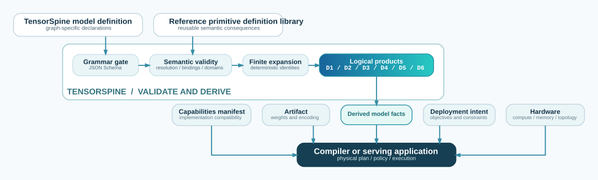

# TensorSpine architecture and design rationale

> Describe a model's reusable logical structure once, derive its consequences mechanically, and
> leave physical execution choices to the systems that have the information to make them.

*Non-normative design rationale — 28 August 2026.*

This document explains why TensorSpine is divided into model definitions, primitive library primitives, validation,
and derived products. It is written for contributors deciding where a new fact or capability
belongs. The [language specification](SPECIFICATION.md) remains the sole authority for syntax,
validity, and denotation; the [model JSON guide](TENSORSPINE-MODEL_JSON.md) explains the concrete
format, and the [glossary](GLOSSARY.md) defines the project vocabulary. If this document conflicts
with the specification, the specification wins.

This is the architecture of the language and its information boundaries. It is not a prescribed
architecture for a serving runtime.

## 1. Architecture at a glance

TensorSpine sits between model authorship and execution. Its output is logical information that a
compiler or runtime can combine with an implementation, an artifact, deployment intent, and actual
hardware.

**Language pipeline: one denotation; many implementation-owned execution plans**

<!-- Title above. -->

### 1.1. What D1–D6 expose

A **derived product** is a logical view computed from one valid TensorSpine model definition, its
resolved primitives, and one assignment of its external quantities. D1 supplies the common
identifier space: D2–D6 refer back to its instances, values, and graph splits.

The normative definition is reproduced from
[Specification §7](SPECIFICATION.md#7--required-derived-products); section references in this table
point to the specification.

| Product | Content |
|---|---|
| **D1** | **Expanded graph:** instances, edges, and families; per instance, whether its primitive reads across positions (§4.1). |
| **D2** | **Values:** the value and shape inventory; the payload of every valid graph split — the values live at it, sized per invocation; the peak of live values along one order of the graph, the activation peak of an invocation; and the fragment alignment of every fragmented stream (§5.3). |
| **D3** | **Parameter tensors:** shapes, sharing, and total count; the role, selected dtype and sensitivity of every tensor; when the document locates its weights, the evaluated location of every tensor. |
| **D4** | **Complete state:** descriptors, instances, keys, state liveness, visits per phase, and permitted operations. |
| **D5** | **Logical costs:** parameters, activations, state per element, computation — derived from the inventory and the declared corrections (§4.1) — and the payload crossing each valid graph split per invocation. |
| **D6** | **Valid graph splits and semantic partition axes:** the valid graph splits of the expanded graph, and for every instance the partition options its primitive declares with their communications and granularity; a flattened axis without factors is reported as information loss (O5.10). Partition options are declared per instance; their consistency across instances — the residual width through norm, add and feed-forward, a head partition aligned to the KV groups of its layer — is compilation's (§10.3), the axis identities on D1's edges being what a compiler aligns. |

`tensorspine --d1` emits only D1: the expanded graph, without the values, tensors,
state, costs, or partition facts in D2–D6. `tensorspine --derive` emits all six in one
[TensorSpine derived document](TENSORSPINE-DERIVED_JSON.md), where the later products join directly
to D1 identifiers.

The specification governs the meaning of this pipeline. The schema automates the grammar gate; it
does not replace semantic validation. Likewise, D1–D6 do not choose kernels, memory layouts, shards,
devices, or a scheduling policy. Those decisions occur downstream.

## 2. Ownership of facts

The ownership rule and its field test are normative in
[Specification §1.2](SPECIFICATION.md#12--governing-principle); facts that depend on a selected
implementation, artifact, deployment or machine belong outside both model and primitive.

| Authority | Facts it owns |
|---|---|
| **Model Definition** | Model identity; source quantities; instances and compositions; explicit value flow; actual parameter, constant, and state identities and their dtypes; public inputs with their kind, stream and fragmentation, and public outputs. Instance keys, liveness, visit rates and carrying across fragments are derived from these (§4.4, §5.3) |
| **Primitive primitive** | Argument types and declared defaults; ports, shapes and domain transforms; logical parameter, constant, and state slots; state evolution rule, access geometry and carrying condition; effects; cost corrections and sparsity units; semantic partition axes |
| **Primitive Library** | Resolution of independently identified primitives, axes, and precision roles; no global primitive library version |
| **Primitive Definition reference implementation** | Supplied with a new primitive by its author; it becomes that primitive version's witness, with declared tolerances and unit fixtures |
| **Reference generator** | The repository's target generator: TensorSpine's conformance tooling uses it to execute primitive witnesses and compare model integrations against each delivery implementation |
| **Serving application** | The primitive subset it implements; targeted backends, optimized kernels, algorithms, fusions, workspace, physical layouts and traffic, physical partition options and actual collectives; its harness and serving policy. TensorSpine tooling builds and evaluates its capabilities manifest ([capabilities](../generators/CAPABILITIES.md)) |
| **Location** (in the model definition) | The physical tensor each logical tensor is stored as (Specification §3.4, V17); the artifact's encoding — file format, sharding, quantisation containers — stays outside |
| **Compilation or deployment control** | Hardware topology, placement, resolved sharding, load variables, admission, and scheduling policy |
| **[Status page](https://maneex.github.io/tensorspine/status/)** (generated) | Primitive Library, corpus, coverage and verification state at one commit; never validity or meaning |

This division prevents two authorities from making the same claim. A model can declare that two
instances share state, but it cannot redefine the state's payload. A primitive can make a state
shareable, but it cannot assert that two particular instances actually share it. See
[Specification §1.2](SPECIFICATION.md#12--governing-principle) and
[§3.4](SPECIFICATION.md#34--bindings) and
[§4.4](SPECIFICATION.md#44--information-supplied-by-the-graph).

## 3. Architectural decisions

### 3.1. Describe logical structure, not executable computation

**Decision.** A TensorSpine model is a finite graph of primitive instances and explicit bindings.
It does not contain kernels, general tensor programs, Python classes, implementation or backend
choices, or hardware placement.

**Why.** Executable reference code entangles logical structure with one implementation. Every
serving engine then has to recover dimensions, tensors, state lifetime, and partition boundaries
from code written for a different purpose. A compute graph preserves operations but commonly reduces
persistent state to ordinary tensor arguments, losing why storage grows, how long it lives, and what
may be shared. TensorSpine records those logical facts directly.

**Consequences.** One model declaration can be matched to different implementations and machines.
The cost is that TensorSpine is not executable by itself: a consumer still needs implementations for
the primitive definitions, a compatible artifact, and deployment decisions.

This is the boundary the language exists to draw:

> **TensorSpine separates model support from kernel support.** A new model architecture should not
> require new runtime code unless it introduces genuinely new computational semantics. A runtime
> should need new code when computation changes, not merely because a model name changes.

The test is mechanical, and §8.1 of the specification already states it: new nodes come from new
primitives. A model that arranges existing primitives differently — however novel its paper — adds a
document and nothing else. A model whose state evolves by a evolution no primitive describes, or whose
operator has no primitive, requires the lab to add a primitive and its reference implementation. Each
serving application that supports it adds one conforming primitive implementation, reusable by every
model that uses it. What must never be true is new code because only the model name changed.

**Alternatives not chosen.** A delivery implementation is not the authority for a graph; a
primitive's reference implementation is the authority for the primitive. An engine-specific
architecture class or compute graph alone is not a semantic authority for TensorSpine. See
[Specification §9.2](SPECIFICATION.md#92--non-requirements) and the
[project motivation](../README.md#1-why-tensorspine).

### 3.2. Separate model facts from primitive facts

**Decision.** An instance supplies a primitive identity and arguments. The primitive derives every
reusable consequence of that pair; the model declares only relationships and choices that the
primitive cannot know in isolation.

**Why.** Copying port shapes, parameter inventories, or state evolution rules into every model creates two
sources of truth. The copies eventually drift, and a consumer must decide which one to believe.
Keeping consequences in versioned primitives makes them reusable and mechanically checkable.

**Consequences.** Model Definitions remain smaller and contradictions become validation failures.
Primitive Library resolution is therefore part of reading a model, and a model is incomplete if a referenced
primitive cannot be resolved.

**Alternatives not chosen.** Self-contained models that repeat the full primitive definition were
rejected because convenience at one read site would create long-term semantic duplication. See
[Specification §4](SPECIFICATION.md#4--primitive-semantic-primitives).

### 3.3. Make graph topology and identity explicit

**Decision.** Value flow is a set of directed port bindings. Parameter, constant, and state sharing
is represented by explicit logical identities. Instance order, matching names, equal shapes, and
implicit mutation do not create edges or sharing.

**Why.** Explicit topology makes value liveness, graph splits, totality, weight tying, and state
sharing derivable without conventions known only to one engine. It also distinguishes “two equal
tensors” from “one tensor used twice,” which matters for loading, counting, and placement.

**Consequences.** Bindings are more verbose than a sequential module list, and they must be total
and unique after expansion. Compositions and `for_each` reduce repetition, but they never weaken the
explicit graph semantics.

A third consequence is model-independent fusion. A serving application rewrites D1 by matching
primitive identities and edges—for example, normalisation feeding attention feeding a residual add,
or a router feeding its experts—then dispatches the group to one fused implementation. Because the
match never reads the model name, the same rewrite serves every document containing that pattern.
D6 graph splits inside the group remain semantically valid; a fused execution can honour one only by
decomposing the rewrite, so its execution plan reports the blocks it actually selected. The
repository generators already expose such blocks through the reference generator's `--max-ram`
plan and the ZML generator's `--split`. Identity enables the match but does not define kernel
computation; the serving application relies on the primitive witnesses for that (§3.1).

**Alternatives not chosen.** Implicit residual streams, parameter-name conventions, module order,
and shape equality are not authorities for connectivity or identity. See
[Specification §3.4](SPECIFICATION.md#34--bindings).

### 3.4. Keep the primitive library open and each semantic language closed

**Decision.** The primitive library is extensible with new primitive definitions, axes, and precision roles.
Within a primitive, the scalar algebra, conditions, state properties, and other derived vocabularies
are closed and decidable. Unknown vocabulary is rejected rather than ignored.

**Why.** An open primitive definition library lets the graph language represent new operation kinds without a
new top-level model grammar. Closed sublanguages let a consumer determine exactly what it must
implement, validate every construction, and bound the cost of an extension before accepting a
model.

**Consequences.** Adding a primitive can still require a new consumer capability; “open primitive library”
does not mean “every consumer accepts every future primitive.” A template primitive can avoid a
new primitive capability only when its transitive template uses primitives the consumer already
supports.

**Alternatives not chosen.** Arbitrary extension objects, unknown fields, and executable callbacks
would make acceptance depend on hidden code and would defeat exhaustive rejection. See
[Specification §2.2](SPECIFICATION.md#22--derivation-algebra-and-qualified-values-o01-o02-o03-o05-o06) and
[§8.1](SPECIFICATION.md#81--extension-kinds).

### 3.5. Represent expressions as tagged data, not strings or code

**Decision.** Model and primitive expressions are tagged JSON unions such as `literal`, `quantity`,
`argument`, `index`, and `op`. Operators come from a closed set. A derivation outside that set must
use a separately specified normative interface.

**Why.** A string needs another parser and creates ambiguity between names, literals, and syntax.
General-purpose code is not portable, safely inspectable, or decidable. Tagged data can be validated
structurally, traversed without evaluation, and interpreted identically by independent consumers.

**Consequences.** Expressions are more verbose, and adding an operator is a language-design action
rather than a convenience function. That friction is intentional: every new operator needs defined
types, domains, failure behavior, and status propagation.

**Alternatives not chosen.** String interpolation, Python-like expressions, and trusted helper
functions are not part of the model language. See
[Specification §2.2](SPECIFICATION.md#22--derivation-algebra-and-qualified-values-o01-o02-o03-o05-o06).

### 3.6. Version meanings independently

**Decision.** Each instance pins a primitive definition by `{name, version}`. Primitive Definition identities
are immutable: a published `{name, version}` never changes meaning, and a changed meaning is a new
identity. The primitive library has no global version. A template is versioned the same way, in its own
immutable file, and a primitive pins one template version. The digits of a version classify a change
— patch, minor, major — and a pin is always exact (§8.2). During the specification stage every unit
is at `1.0.0`; the mechanism, not the numbers, is the decision.

**Why.** Primitives evolve independently. A global primitive library version would couple unrelated changes
and force consumers and models to coordinate upgrades that do not affect them. An unversioned
“latest” primitive would make yesterday's model mean something different tomorrow.

**Consequences.** Resolvers must be deterministic, and once primitives evolve, consumers may need to
support several identities of one primitive. Compatible additions do not require a model-language
version change, but changing an existing argument, slot, port, or state meaning requires a new
primitive identity.

**Alternatives not chosen.** Mutable primitive names and one global primitive library release number are not
semantic identities. See [Specification §8.2](SPECIFICATION.md#82--identity-and-versioning).

### 3.7. Qualify derived knowledge

**Decision.** A quantity derived inside a model definition is exact by construction — an expression
over declared constants — and is checked against its declared type, domain and, for a literal read
from configuration, its declared derivation. Where a value can be a bound or an estimate — a
primitive's logical cost, the derived products — it carries an epistemic status (`exact`,
`upper_bound`, `lower_bound`, or `estimate`) and provenance, and status propagates according to the
operation and its domain; an estimate never silently becomes a bound.

**Why.** Placement and admission decisions depend not only on a number but on what is known about
that number. Treating an estimate as an exact byte count can make an apparently valid plan fail at
runtime. Direction also matters: dividing *by* an upper bound produces a lower bound, while dividing
an upper bound by an exact positive value keeps it an upper bound; the table in the specification
fixes every case, so no reader has to reason it out.

**Consequences.** Derivations carry more metadata, and consumers need a status algebra rather than a
single numeric evaluator. In return, uncertainty and information loss remain visible instead of
being converted into false precision.

**Alternatives not chosen.** Unqualified numbers, comments such as “approximately,” and
implementation-specific confidence conventions cannot support mechanical contradiction or safe
planning. See [Specification §2.2](SPECIFICATION.md#22--derivation-algebra-and-qualified-values-o01-o02-o03-o05-o06).

### 3.8. Fail closed and allow only declared defaults

**Decision.** Missing required information, unknown fields, unknown arguments, unrecognized values,
and meaningless combinations cause reasoned rejection. Defaults are allowed only when a primitive
declares and versions them explicitly.

**Why.** Permissive readers create dangerous forward-compatibility failures: an old consumer may
accept a new document while silently discarding the fact that changes its meaning. A declared
default is different—it is inspectable, reproducible, and part of the pinned primitive.

**Consequences.** Older consumers reject some newer documents instead of attempting a best effort.
That is a compatibility feature: refusal is observable, while a plausible but wrong interpretation
may fail much later. Advisory style belongs to lint; validity failures block.

**Alternatives not chosen.** Implementation defaults, ignored extension fields, and “unknown means
false” behavior violate the no-silent-default invariant. See
[Specification §8.1](SPECIFICATION.md#81--extension-kinds) and
[§9.1](SPECIFICATION.md#91--invariants).

### 3.9. Expand to one finite authoritative graph

**Decision.** A model definition may generate instances through finite compositions, conditions,
and parameter assignments. Deterministic expansion produces D1, the authoritative instance graph.
All validity rules apply to that expanded graph. Recurrence crosses invocations through
state ports, never through a combinational value cycle.

**Why.** Repetition is necessary for compact authoring, but every consumer needs the same concrete
nodes, edges, and identities. Requiring finite, deterministic expansion makes graph validation and
all later derivations decidable.

**Consequences.** Data-dependent or unbounded topology is outside the model language. A
parameterized document denotes a graph family and needs an admissible assignment before it denotes
one concrete graph. Unique written representation is not required; unique meaning per assignment
is. Expanded identifiers are representation, not meaning: two expansions are the same graph when
their instances correspond one-to-one up to renaming, with primitives, arguments, edges, sharing,
interface names and identity names preserved.

**Alternatives not chosen.** General loops, recursive graph construction, runtime-dependent node
creation, and implicit recurrence would prevent a consumer from knowing the graph before execution.
Reusable parameterized submodels use acyclic template primitives instead of nested composition
syntax. See [Specification §5](SPECIFICATION.md#5--denotation).

### 3.10. Split state descriptors from state topology

**Decision.** A primitive derives what one state port means: presence, payload, evolution, indexing,
access geometry, sharing capability, permitted operations, and the condition under which the state
is carried across fragments of its stream. The expanded graph declares how many ports exist and
which ports share one identity; whether a state survives between fragments follows from that
condition and the input's fragmentation, and is never written twice.

**Why.** A primitive can know that a KV cache is indexed by a source sequence; it cannot know which
encoder output the model wires to that source. It can permit sharing; it cannot know that two
non-adjacent layers share storage. These are topological facts.

**Consequences.** State cannot be summarized safely by one cache-type enum or one head size. Authors
declare only identity, sharing and the fragmentation of inputs; keys, liveness, visit rates and
carrying are derived, and runtimes can then budget arbitrary mixtures of growing, windowed, recurrent, shared,
and streaming state without architecture-specific cases.

**Alternatives not chosen.** State blocks copied into every model, cache types inferred from
primitive names, and case-specific fields for cross-attention or shared KV all duplicate or hide
semantics. See [Specification §4.3](SPECIFICATION.md#43--state-derivation) and
[§4.4](SPECIFICATION.md#44--information-supplied-by-the-graph).

### 3.11. Derive logical options; choose physical plans downstream

**Decision.** D1–D6 describe the expanded graph, values, logical tensors, state, logical costs, and
semantic graph splits. They expose what is valid and what it logically costs. They do not select a kernel,
device, collective, placement, or schedule.

**Why.** Physical choices depend on facts that can change without changing the model: available
hardware, topology, workload, installed kernels, memory pressure, and policy. Embedding those
choices in the model would make model identity depend on a deployment.

**Consequences.** The same TensorSpine model can be compiled differently for one accelerator, a
cluster, or a heterogeneous system. TensorSpine provides feasibility inputs and reference logical
costs, not a promise of performance or a complete deployment plan.

**Alternatives not chosen.** Resolved sharding, physical traffic, batch size, cache pages, admission,
and scheduling do not belong in the model definition or primitive definition. See
[Specification §7](SPECIFICATION.md#7--required-derived-products) and
[§10.3](SPECIFICATION.md#103--explicitly-separate-concerns).

## 4. Validation and derivation boundaries

Validation is deliberately staged:

1. **Structural validation** checks the JSON grammar: required fields, types, closed objects, and
   tagged-union shapes.
2. **Resolution** loads primitive library bases in order and resolves every referenced identity and pinned
   primitive version.
3. **Semantic validation** checks facts the schema cannot: arguments, conditional presence, shapes,
   indexing domains, total bindings, compatible identities, and acyclicity.
4. **Expansion** evaluates finite index ranges and conditions, expands templates, and emits
   D1 with deterministic identities.
5. **Derivation** computes the remaining logical products from the valid expanded graph and resolved
   primitives.

These stages have different authorities. JSON Schema cannot prove that a port exists in a referenced
primitive; semantic validation must. Lint cannot turn a valid style preference into a validity rule.
A downstream compiler cannot repair an ambiguous model by guessing what the author intended.

The specification defines the required result independently of repository tooling. Tool, corpus and
implementation state belongs on the generated
[status page](https://maneex.github.io/tensorspine/status/), not in the language architecture.

## 5. Contributor decision guide

When adding a field, primitive feature, or derived product, apply these questions in order:

1. **Does the fact vary between models that use the same primitive with the same arguments?** Put it
   in the model graph. Otherwise derive it in the primitive.
2. **Does the fact depend on a kernel, physical artifact, machine, workload, or policy?** Keep it out
   of both model and primitive; place it in the appropriate downstream authority.
3. **Can existing primitives express the operation as a finite template?** Prefer a template
   primitive when it preserves the intended semantic identity and introduces no hidden capability.
4. **Does an existing primitive meaning change?** Publish a new primitive identity. Do not mutate the
   old version.
5. **Does the proposal add syntax or a new operator, condition, or closed property value?** Define
   its semantics, domains, rejection behavior, and consumer cost; do not hide it in an extension
   object.
6. **Is a derived value exact, bounded, or estimated?** In a model definition it is exact, or it does
   not belong there; in a cost or a product, record its status and provenance, then check that the
   algebra preserves that qualification.
7. **Can any consumer interpret the document in two ways?** Redesign the construction until one
   reading remains, or reject it.
8. **Would omitting the field leave the denotation unchanged and cause no rejection?** Then it is
   documentation, not semantics.

This checklist is explanatory. The corresponding requirements remain the invariants and mutation
test in [Specification §9.1](SPECIFICATION.md#91--invariants) and
[§10.2](SPECIFICATION.md#102--required-rejection-cases).

## 6. Deliberately open questions

The architecture leaves several downstream or future designs open:

- downstream compilation APIs that consume D1–D6;
- how implementations advertise physical costs (capabilities are advertised by the manifest in
  `generators/CAPABILITIES.md`);
- how a compiler combines semantic partition options with a selected topology and workload;
- which additional normative interfaces are justified when a derivation cannot fit the closed
  scalar algebra.

Candidates for the language, parked rather than rejected: conditional *absence* of a structural
argument in an argument expression (an expression yields a value, never absence, which is why an
alternating-layer model needs two sites); indexed literal tables for per-repetition
hyperparameters; per-instance activation dtypes; partial retention of a state's components across
fragments; a primitive library-base steward pin (a release tag or content digest in the model's primitive library entry,
with V1 refusing content that differs); content-digest template pins; a `by_fragment` sharing
granularity for a bidirectional streaming encoder's cache (`mask: none` with `streaming`), whose
entries depend on their whole fragment rather than a prefix — it is declared `by_position` today
and exercised by no corpus document; a token-id input port on `moe` for hash routing; a
`sequence`-kind output for a pooler with `reduce`. Sharing across a template boundary is a stated
limit of the graph language (Specification §1), not an open question: the flat form exists.

Architecture families parked outside the language's stated scope are mixture-of-depths,
retained-prefix windows, and diffusion models.

These are not placeholders for hidden behavior. Until specified, they remain outside the model's
denotation. A future design should preserve the same boundaries: one authority per fact, immutable
meanings, deterministic interpretation, qualified knowledge, and explicit rejection.
