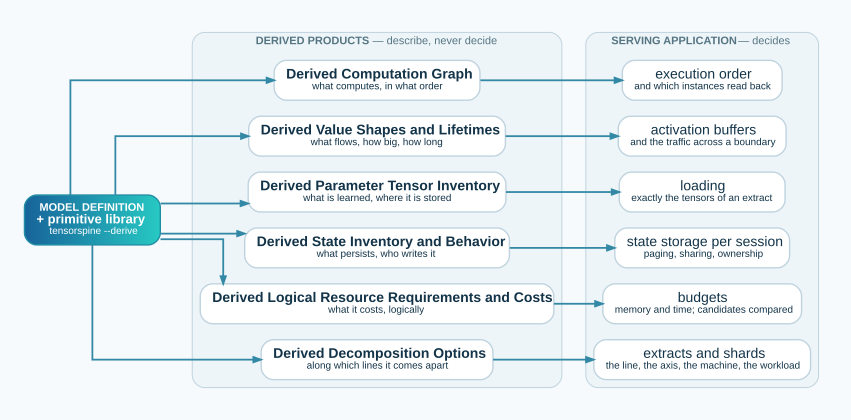
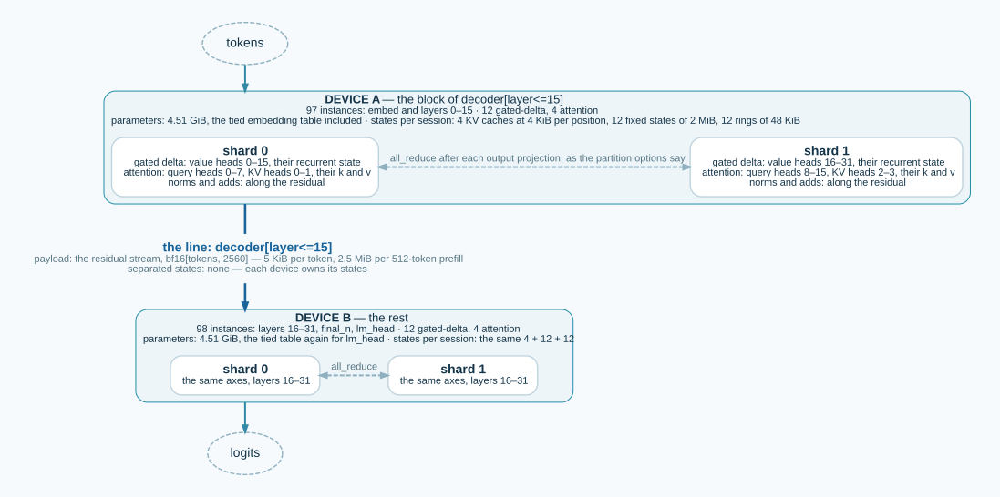

# Reading the derived products

*What each of D1–D6 tells a serving application, what to do with it, and one worked example: turning D6
into a split of `qwen3.5-4b-text` across two devices. Practical, non-normative. The
[derived-document guide](TENSORSPINE-DERIVED_JSON.md) says how the products are written down; the
[harness guide](HARNESS.md) says which serving decision needs which product; [Specification §7](SPECIFICATION.md#7--required-derived-products)
defines them. This guide reads them.*

<a id="0-the-idea"></a>

## 0 — The idea

A model definition names instances of primitives and wires them. Everything a serving application needs
to *run* that model follows from the definition and the primitive library, by computation: no inference
code, no knowledge of a named architecture. That computation is `tensorspine --derive`, and its output is
six products, each answering one question a consumer asks of a model it has never seen:

| Product | The question it answers | What a serving application does with it |
|---|---|---|
| **D1 — Derived Computation Graph** | What computes, in what order? | Builds the executable graph; knows which instances read across positions |
| **D2 — Derived Value Shapes and Lifetimes** | What flows between instances, how big, how long? | Sizes activation buffers; prices what crosses a boundary |
| **D3 — Derived Parameter Tensor Inventory** | What is learned, and where is it stored? | Loads exactly the tensors it needs, from the checkpoint the document locates |
| **D4 — Derived State Inventory and Behavior** | What persists between invocations, who writes it? | Allocates per-session storage; decides paging, sharing and ownership |
| **D5 — Derived Logical Resource Requirements and Costs** | What does it cost, logically? | Budgets memory and computation; compares candidates |
| **D6 — Derived Decomposition Options** | Along which lines can it be taken apart? | Cuts the graph into extracts and shards inside each |



The products describe; they never decide. Which line to cut on, which axis to shard, on what machine,
for what workload, is the serving application's (§10.3). What follows walks the six on one model.

<a id="1-the-running-example"></a>

## 1 — The running example

`qwen3.5-4b-text`, the text decoder of Qwen 3.5 4B: 32 layers, three gated-delta layers for every
attention layer (attention at layers 3, 7, 11, …, 31), width 2560, 16 query heads over 4 KV heads of
256, gated delta with 16 key heads and 32 value heads of 128, a vocabulary of 248 320 rows, and the
embedding table tied to the output head. Every figure below comes from one command:

```sh
python3 tools/tensorspine --derive data/models/qwen3.5-4b-text.json -o out/
```

<a id="2-d1"></a>

## 2 — D1, the graph

**What it says.** 195 instances and 258 edges, in one topological order, with families attached: 24
`sequence.gated_delta`, 8 `attention.dense`, 32 `ffn.gated`, 64 `residual.add`, 65 `norm.rms`, one
`embed`, one `lm_head`. Every instance carries its primitive and version, its resolved arguments — for
`decoder/attn[layer=3]`: width 2560, 16 heads, 4 KV heads, head dimension 256, causal mask, a partial
rotary embedding — and one flag, `across_positions`: true for the gated-delta and attention instances,
which read positions other than the one they produce, false for everything else.

**What to do with it.** Walk `topological_order` and you have an execution plan that needs nothing
else; the reference generator does exactly that. Use the families as handles: `full_attention` names
the eight attention layers, `linear_attention` the twenty-four others, without parsing names. Use
`across_positions` to know which instances need a state on a fragmented stream (§5.3) — every one that
reads back — and which are pure functions of their element.

<a id="3-d2"></a>

## 3 — D2, the values

**What it says.** 196 values, each with its shape *per element*, its dtype, its producer and consumers,
and the stream it is indexed by. For every structural graph split, the **payload**: the values live at
the split, each sized per element and multiplied by the invocation's counts. At `decoder[layer<=15]` one
value crosses, `decoder/mlp_r[layer=15].output` — the residual stream, `bf16[tokens, 2560]` — 5 120
bytes per token. The **peak of live values** along the order: 998 400 bytes per element, at `lm_head`,
where the f32 logits over 248 320 rows sit beside the residual.

**What to do with it.** Multiply by the workload: a prefill of 512 tokens moves 2.5 MiB across that
split, a decode step 5 KiB. Size the activation arena from the peak: one element's peak times the
elements an invocation carries. What D2 does *not* give is a count — how many tokens, how many
sessions — because counts are deployment intent, never a model fact.

<a id="4-d3"></a>

## 4 — D3, the parameters

**What it says.** 426 tensors, 4.21 billion elements, 8.41 GB, one of them tied: `embed.weight` is also
`lm_head.weight`, `bf16[248320, 2560]`, 1.27 GB, stored once at
`model.language_model.embed_tokens.weight`. Each tensor has an identity, its shape as stored, its dtype and
precision role, its members — the instance slots that read it — and, because this document locates its
weights, the safetensors tensor that holds it: `decoder.gdn.qkv[layer=0]`, `bf16[8192, 2560]`, is
`model.language_model.layers.0.linear_attn.in_proj_qkv.weight`.

**What to do with it.** Load by identity, from the location, never by guessing names: `tensorspine
--validate --checkpoint DIR` has already checked that every located tensor exists with the shape and
dtype the document says (V17). Given a set of instances — an extract — the members tell which identities
it needs, and the locations which bytes to read. Note the tied tensor: whichever side of a split holds
`lm_head` holds the same 1.27 GB as the side that holds `embed`.

<a id="5-d4"></a>

## 5 — D4, the states

**What it says.** 56 state identities, one per layer and state port, each with its evolution, its
access, its sharing rule, its payload per position and the members that touch it:

| Identity (one per layer) | Evolution | Payload per position | Sharing | Bounded by |
|---|---|---|---|---|
| `decoder.attn.kv[layer=k]`, 8 of them | `append` | k and v, `bf16[4, 256]` each — 4 KiB | `by_position` | the session's length |
| `decoder.gdn.recurrent[layer=k]`, 24 | `fixed` | one matrix per value head, `f32[32, 128, 128]` — 2 MiB | `at_fork_point` | itself: 2 MiB |
| `decoder.gdn.conv[layer=k]`, 24 | `window` | one past input, `bf16[8192]` — 16 KiB | `within_span` | a ring of 3 — 48 KiB |

The instance key is `[layer, instance.session, instance.branch]`: one storage per session and branch.
Each identity names its **writer** — here every identity has one member, which writes it — and its
**visits**: the KV cache is written once per new element and read once per element produced; the
recurrent state is written and read once per element.

**What to do with it.** Allocate per session: 32 KiB per cached position for the eight KV caches,
48 MiB of fixed state, 1.2 MB of rings. Page the `append` states — their positions are logical, so a
page is any number of positions times the bytes per position. Share what the rules allow: KV by
position between sessions with a common prefix, the recurrent state only up to a fork, the ring only
within its span. Know who writes: a member that reads an identity written elsewhere is served through
the state, and a `window` state serves nothing older than its span.

<a id="6-d5"></a>

## 6 — D5, the costs

**What it says.** Parameters: 8.41 GB, exact. Computation: 8.44 Gop per element, exact — two operations
per weight element per element, plus every declared correction. State: the D4 totals. The payload of
every split, per element and per invocation, in bytes. Each figure carries its status — exact, bounded
or estimated — and never a count of anything executed.

**What to do with it.** Budget: a device's memory is weights plus state per session times sessions plus
the activation peak; its time is operations per element times elements. Compare candidates before
running any: two splits, two shardings, two dtypes. D5 is logical: what the model requires, not what an
implementation achieves.

<a id="7-d6"></a>

## 7 — D6, the decomposition

**What it says.** Two decompositions, both described, neither chosen.

*Sequential — the graph splits.* 31 layer splits, `decoder[layer<=0]` … `decoder[layer<=30]`, and 8
family splits. Each is valid by construction — the ancestor closure of a layer prefix or a family, so
every crossing edge points forward — and each states its **block**, the instances on the first side in
D1 order, and its **separated states**, the identities with members on both sides. On this model no
split separates a state: every identity has one member. Any prefix of D1's order is a valid split too;
D6 names the structural ones.

*Parallel — the partition options.* Per instance, the axes along which its primitive may be split without
changing its meaning, with the communication each implies and the granularity a shard keeps whole:

| Instance | Target | Communication | Granularity |
|---|---|---|---|
| `decoder/attn[layer=3]` | `attention.heads` (argument axis) | `all_reduce` | 4 — a whole KV group |
| | `attention.kv_heads` (argument axis) | `all_reduce` | 1 |
| | `instance.session` (instance-key axis) | `none` | 1 |
| | the `kv` state, `k` and `v`, by `attention.kv_heads` (payload axis) | `none` | 1 |
| `decoder/gdn[layer=0]` | `deltanet.value_heads` (argument axis) | `all_reduce` | 2 — a whole key-head group |
| | `instance.session` | `none` | 1 |
| | the `recurrent` state by `deltanet.value_heads` (payload axis) | `none` | 2 |
| `norm.rms`, `residual.add` | any axis | `none` | 1 |

And the **information loss**: the gated delta's `z` slot has a flattened axis, `deltanet.value_dim`, whose
factors the primitive does not declare, so whether it partitions along value heads is unknown — reported
as unknown, never as impossible.

**What to do with it.** Cut and shard. The example below does both.

<a id="8-from-d6-to-a-split"></a>

## 8 — From D6 to a split: `qwen3.5-4b-text` on two devices

The serving application has two devices, each with two accelerators, and wants a two-stage pipeline
with tensor parallelism inside each stage. Nothing in what follows needs the model's source or the
primitive library: the derived document suffices, and every number is in it.



**Step 1 — choose the line, from D6.** `decoder[layer<=15]`: its block is 97 instances — `embed` and
layers 0 to 15 — and the other side 98 — layers 16 to 31, `final_n`, `lm_head`. Both sides hold 12
gated-delta layers and 4 attention layers, which is what balances a pipeline. `separated_states` is
empty: every state's writer and readers sit on one side, so nothing persistent crosses the line.

**Step 2 — price the line, from D2.** One value crosses: the residual stream, 5 120 bytes per token.
For a workload of one session, 512-token prefills and one-token decodes: 2.5 MiB per prefill, 5 KiB per
decode step. That is the pipeline's inter-stage traffic, and all of it.

**Step 3 — load each side, from D3.** The block's members name the identities each device holds:
4.51 GiB each — 3.33 GiB of layers and the 1.18 GiB embedding table, which D3 marks as tied to the
output head, so device A holds it for `embed` and device B holds the same bytes for `lm_head`. A serving
application that minds the duplicate chooses a line that keeps `embed` and `lm_head` together, or
accepts 1.18 GiB twice; D3 is what lets it see the choice.

**Step 4 — allocate each side, from D4.** Per session on each device: 4 KV caches at 4 KiB per cached
position — 64 MiB at 4 096 positions — 12 recurrent states of 2 MiB and 12 rings of 48 KiB. Each device
owns its states outright: no identity spans the line.

**Step 5 — shard inside each side, from D6's partition options.** Two accelerators per device:

- the gated-delta layers by value heads — 32 heads in groups of 2, so 16 heads per shard — with an
  `all_reduce` after the output projection; the `recurrent` state follows, 16 of its 32 matrices per
  shard, no communication;
- the attention layers by query heads in whole KV groups — 16 heads in groups of 4, so 8 per shard,
  and with them 2 of the 4 KV heads — with an `all_reduce` after the output projection; the KV cache
  follows by KV head, `k` and `v` alike, 2 heads per shard, no communication;
- the norms and residual adds along any axis, so along the residual's width as the projections leave it;
- the `z` slot of the gated delta is where D6 says *unknown*: its flattened axis declares no factors, so
  the planner keeps that projection whole on each shard, or asks the primitive's author to declare the
  factors — it does not guess.

Sessions are an independent axis throughout: a second session may go to a second replica with no
communication at all.

**Step 6 — check the pieces can run, from the generators' manifests.** `tensorspine --capabilities
generators/zml/capabilities.json data/models/qwen3.5-4b-text.json` says, instance by instance, whether
an implementation admits the arguments each block carries — the mixed rotary embedding, the gated
delta's convolution — before anything is loaded.

What the serving application decided: the line, the shard count, the workload, the machine. What it
never had to know: that this model is a Qwen, that the attention is grouped-query, that a delta rule
keeps a matrix per value head, or which safetensors file holds what. All of that was derived.

<a id="9-what-is-not-in-the-products"></a>

## 9 — What is not in the products

Counts — tokens per invocation, sessions, batch — are deployment intent. Physical costs — what a shard
costs on a backend — are the implementation's. Hardware topology, placement and scheduling belong to
deployment control (Architecture §2). And a decision: D6 lists lines and axes; choosing among them is
the serving application's, which is why nothing here is called a plan.
